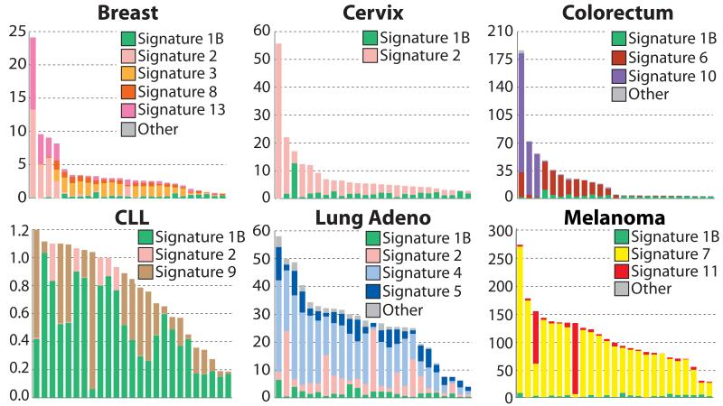
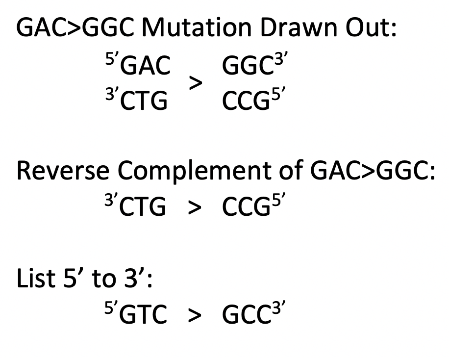
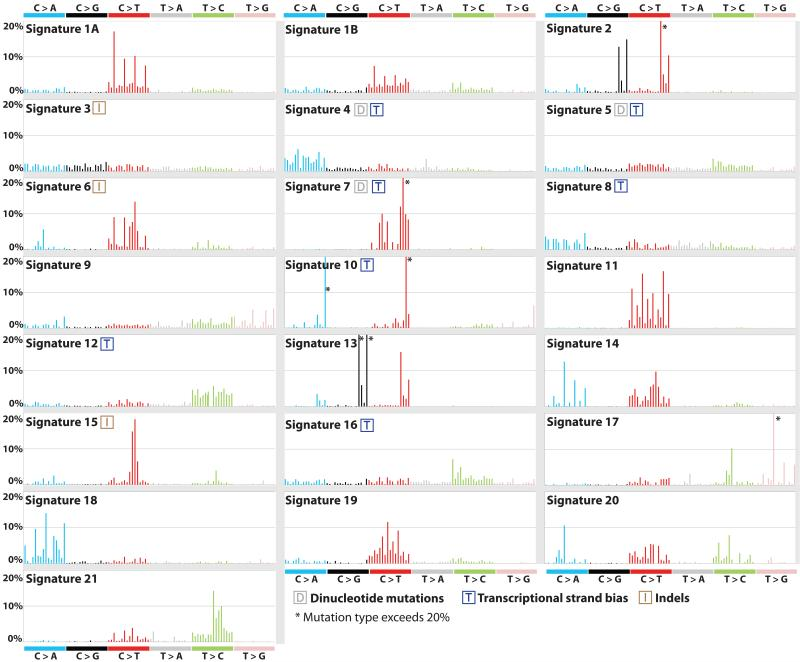
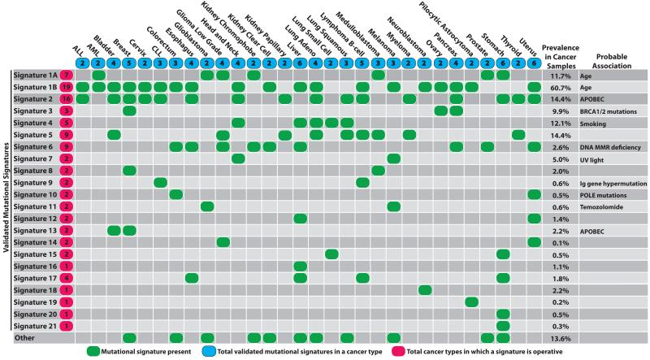
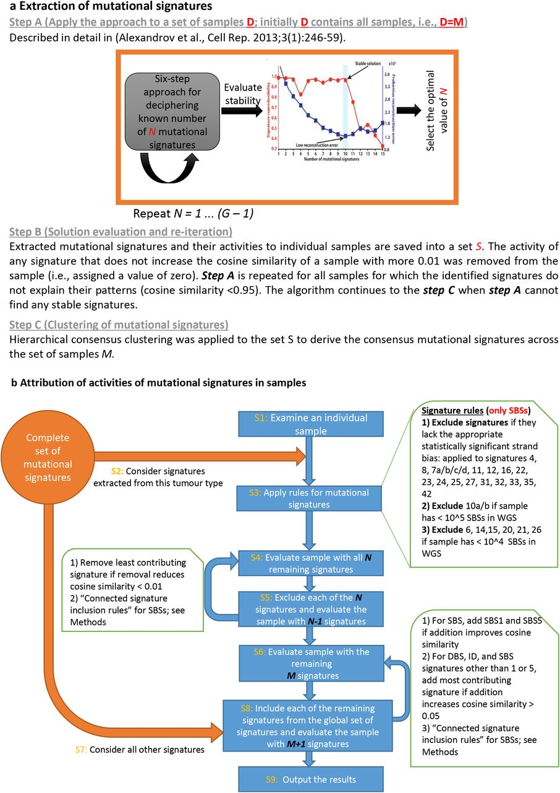

# BENG183-Final-Project: Mutational Signatures
*Group 05:* Zoey Chesny, Kevin Ngo, Arielle Yoo

## Outline
1. [Background](#1) 
   a. [Cancer](#2) 
   b. [Somatic Mutations](#3) 
2. [Mutational Signatures](#4) 
  a. [Discovery - A Case Study](#5) 
  b. [Types](#6) 
  c. [Various Extraction Methods](#7) 
3. [Relevance](#8) 
  a. [Sequencing Analysis for Cancer Research](#9) 
  b. [Current Clinical Aspects](#10) 
4. [References](#11) 

---
## Background 
Mutational Signatures are characteristic combinations of mutation types, which arise from specific mutational processes. These are often associated with cancer and cancer profiling. We'll first discuss how cancer arises from somatic mutations, and then get into the details of how mutational signatures were discovered, the various types, and how they are extracted. We'll then discuss the relevance of mutational signatures as it relates to sequencing analysis in cancer research and in the clinical setting.  

1. [Cancer](#2) 
2. [Somatic Mutations](#3) 

---
## Cancer 
Cancer is the term for the collection of diseases resulting from abnormal cell division. Tumors caused by cancer divide without control and invade nearby cells and tissues (1). All cancer originates from somatic mutations (2). Cancer is caused by multiple DNA alterations in the cell, although most mutations in genomes do not bear a strong impact on cancer selection (2). 

###### Figure 1: Normal cell division is shown on the left. If there is cell damage that cannot be repaired, the cell will enter programmed cell death. Cell division of cancerous cells is shown on the right. The cell is unable to repair itself after each sequential mutation. Eventually, these mutations accumulate and result in uncontrolled cell growth (9).

Different types of cancer arise depending on the different combinations of mutations that and the tissue type that these mutations occur in. Different somatic mutational processes generate unique combinations of mutations in cancers called mutational signatures. Some signatures correlate with the age of the patient, defects in DNA maintenance or mutagenic exposures; but many signatures have other unknown origins (2). These mutational signatures are generated from weighing a single mutation from each cancer sample against an aggregated set of cancer mutations from multiple cases of a particular type of cancer. The signature that explains the majority of the somatic mutational processes for the tumor is then reported using a mathematical model. Analyses of the mutational signatures can indicate the damaged component of DNA and which replicative pathways and DNA repair did not function as normal during the development of the disease. Potentially, the mutational signatures can be used to discern active mutational processes from past mutations revealing new anticancer therapy target sites (4).

###### Figure 2: The contributions of mutational signatures to individual cancers of selected cancer types. Bars represent a typical sample of the particular cancer type, and the vertical axis shows the number of mutations per megabase (2).

---
## Somatic Mutations 
Somatic mutations are defined as mutations that occur in any non–germ cell of the body after conception (5). Types of somatic mutations include single base substitutions; insertions or deletions of small or large segments of DNA; rearrangements, in which DNA breaks and then ligates to a DNA segment from elsewhere in the genome; copy number variations where the number of copies of a specific sequence deviates from the two copies present in the normal diploid genome (6).

###### Figure 3: This diagram helps visualize common types of somatic mutations. The top chromosome represents the original, unmutated version. Single base substitutions on the far left are where a single base is mutated. Inversions occur when a segment of the chromosome is reversed in place. Deletions are where a section of the chromosome is deleted. Duplications are a type of insertion that copies one section of the chromosome and inserts it elsewhere. Translocations occur when one portion of a chromosome trades places with another portion of a different chromosome (9).

Multiple somatic mutational processes contribute to the characteristic mutational signature in cancer genomes (8). In general, somatic mutations come from either exogenous processes (meaning they are caused by environmental factors) or endogenous processes (meaning they are caused by DNA repair mistakes), both of which create distinctive mutational patterns (7). These mutational processes may superimpose on each other in one individual cancer genome (8). Thus, mathematical methods have been developed to systematically characterize each mutational process contributing to a particular type of cancer by deciperhing mutational signatures, estimating the number of mutations that contributes to each signature in a sample, and calculating the probability of each tumor resulting from a particular mutational class signature (8). The presence or absence of mutational signatures may indicate the cellular process occuring or not occuring in the sample (7). 

###### Figure 4: This chart reveals the prevalence of somatic mutations across human cancer types. Each dot represents a sample, and the red horizontal lines indicate the median number of mutations in the respective cancer type (2).

---
## Mutational Signatures 

1. [Discovery - A Case Study](#5) 
2. [Types](#6) 
3. [Various Extraction Methods](#7) 

---
## Discovery of Mutational Signatures - A Case Study 
In a 1991 paper, a group of researchers discovered that different types of cancer had different p53 mutations. For example, G:C to T:A transversions are the most common substitutions in lung and liver cancer, while transitions are more common in colon, brain, and lymphoid cancers. The paper suggested that different mutation patterns for different tissue types means there are different factors that cause cancer development in different tissues (12). Using new sequencing technology, researchers were able to find most somatic mutations in a melanoma cancer cell line’s genome, report a comprehensive catalogue of these mutations, and show that these mutations related to past ultraviolet-light-induced DNA damage (13). When only sequencing a small cell lung cancer cell line, researchers were also able to identify tobacco smoke related mutations based on how mutation patterns reflected carcinogens present in cigarette smoke (14). However, when analyzing genomic data, there are often multiple mutation pathways that are existing at once, making it difficult to isolate specific patterns from a catalogue of mutations. Using nonnegative matrix factorization to solve this blind source separation problem, researchers were able to isolate these patterns, called mutational signatures, from catalogues of mutations (15). This mathematical process for identifying mutational signatures has been applied to many cancer types in order to find likely cancer causing mechanisms (10).

---
## Types of Mutational Signatures 
In total, there are 96 possible single base substitutions that are documented when performing mutational signatures (4, 10). The mutation types are listed by the pyrimidine base change (4, 10). For example, C:G>A:T would be listed as C>A since C is a pyrimidine. T is the other pyrimidine besides C, so each of the six single base pair changes are C>A, C>G, C>T, T>A, T>C, and T>G. Since we are also considering the 5’ and 3’ adjacent nucleotides, the number of different mutation types changes from six to 96 because there are 16 different combinations of possible 5’ and 3’ adjacent nucleotides. The mutation types are always listed 5’ to 3’, therefore the mutation GAC>GGC (listed 5’ to 3’) would be a GTC>GCC mutation type. This conversion into a mutation type can be found by first finding the reverse complement of GAC>GGC to be CTG>CCG in the 3’ to 5’ direction and then listing each side in the 5’ to 3’ direction.

###### Figure 5: This diagram shows how GAC>GGC would be classified as a GTC>GCC mutation type. Generated by Arielle Yoo.

There are 1,536 classes of mutational signatures when accounting for two flanking bases 5’ and 3’ to the mutated base (8). There are 78 classes of mutational signatures that contain doublet base substitutions (8). There are 83 classes of mutational signatures that are based on the size of indel, repeats, and microhomology. Indels were classified as deletions or insertions of a single base according to their pyrimidine base. Longer indels (up to 50 nucleotides) tend to occur at repeats or with overlapping microhomology at the breakpoints and were classified according to the size of indel, repeat, and microhomology (8).

###### Figure 6: This chart displays validated mutational signatures found in human cancer. Each signature is displayed according to its 96 substitution classification with sequence context immediately 3’ and 5’ to the mutated base. Different colors represent different probabilities of the six types of substitutions. The x-axis depicts mutation type and the y-axis depicts the percentage of mutations attributed to a specific mutation type. All signatures are displayed based on the trinucleotide frequency in the human genome (2).

Various mathematical methods have been developed to extract mutational signatures from cancer sequencing data (8). However, correct signature extraction still requires human judgement and consideration of the available data based on biological plausibility, experimental discrimination of mutational signatures, and evidence of DNA damage and repair. Human-guided sensitivity analysis helps confirm that different samples from various tumors can yield the same signatures (8). 

###### Figure 7: This chart displays the presence of mutational signatures across human cancer types. Signatures are displayed in rows and cancer types are in columns. For most signatures, a significant number of mutations is defined as more than 100 substitutions or more than 25% of all mutations in that sample (2).

---
## Various Methods to Extract Mutational Signatures 
SigProfiler and SignatureAnalyzer are two specific methods that extract mutational signatures from cancer utilizing nonnegative matrix factorization (NMF). NMF is a machine learning technique that uses multivariate analysis and linear algebra to perform clustering approximations to reveal a signal’s component parts (8). This method applies to cancer mutational signatures because NMF can determine the specific mutations which underlie each overall mutational signature for both single cancer types and on all cancer types together (8). It does so by determining both signature profiles and their contributions to each signature to each cancer genome as part of its factorization of the input matrix of mutation spectra (8). This analysis is carried out separately for single base substitutions (SBS signatures), doublet base substitutions (DBS signatures) and indels (ID signatures) as well as for the three mutation types together to generate a composite signature analysis. However, it is possible to reconstruct the mutations seen in a given sample in multiple ways, given the large number of signatures and heterogeneous mutations across samples. Therefore, these two methods differ in their procedure used to estimate the contributions of signatures to each sample in order to minimize the biological implausibility of certain reconstructions (8). 

### SigProfiler
SigProfiler is a further elaborated version of a previous framework developed to generate a set of mutational signatures in the COSMIC catalogue of mutational signatures. This method involves a three step approach to extract the mutational signatures followed by a nine step approach to determine the attribution of activities of mutational signatures in samples (8). 

The first step of signature extraction involves a hierarchical de novo approach using an algorithm to decipher a minimal set of mutational signatures to optimally estimate the contribution of each mutation type in each sample. The identification of such signatures is based on the Kullback-Leibler divergence formula. The next step of mutational signature extraction is solution evaluation and re-iteration. The hierarchical algorithm repeats for all samples that have identified signatures that do not significantly explain their patterns and terminates if the algorithm cannot find any stable signatures. Finally, the clustering of mutational signatures is performed using hierarchical consensus clustering across all the samples (8). 

The first step of determining the attribution of activities of mutational signatures in samples involves examining an individual sample. A complete set of mutational signatures is then used to consider signatures extracted from this tumor type. Next, rules for mutational signatures are applied based on statistical significance to exclude strand bias. The samples with all N remaining signatures are then evaluated and the process of removing the least contributing signature if it reduces the cosine similarity less than 0.01 is repeated. Next, samples are evaluated with only the remaining contributing signatures, and all other global signatures are considered. Each of the signatures are included from the global set of signatures if the addition improves the cosine similarity. Finally, the results of contribution are outputted (8).

See Figure 8 below for a detailed flowchart of how the SigProfiler extraction method works. 

###### Figure 8: SigProfiler Signature Extraction (a) and Attribution (b) (8).

### SignatureAnalyzer 

SignatureAnalyzer is based on a Bayesian variant of NMF that infers the number of signatures through the automatic relevance determination technique and delivers sparse and highly interpretable representations for signature profiles and their attributions (8).

The SignatureAnalyzer extraction uses a two-step process which first randomly searches all mutations in a sample for statistical significance. Due to its random search nature, each run of this algorithm may produce different solutions. The solution with the highest posterior probability after a fixed number of runs is selected. The first step of signature extraction and random searching is again performed but with additional signatures unique to hyper-mutated samples. The results are combined to minimize the effect of bias in ultra-mutated samples, but also use some well-known signatures to explain the mutational effects (8).

The attribution portion is then performed separately for low and ultra-mutated samples in all composite, SBS, DBS, and ID signatures. The activity of signatures is primarily inferred through an automatic relevance determination process applied to an activity matrix with a fixed signature matrix in a NMF technique. Further matrix manipulation is applied and eventual signature-by-sample classification is outputted to show which mutations have the greatest effects on which samples (8).

The results of mutational signature attribution in SigProfiler compared to SignatureAnalyzer are shown in Figure 9. Sample attributions that significantly correlated (R^2 > 0.3 for SigProfiler or > 0.5 for SignatureAnalyzer) are connected with edges. The graph is used to visualize the different association results between the two methods (8).

###### Figure 9: This depicts the relationship between SBS, DBS, and ID signatures comparing SigProfiler (a) to SignatureAnalyzer (b). Different signatures are related to different pathways or environmental conditions in a given cancer sample. This graph shows how particular mutations are attributed to different environmental factors or conditions on synthetic pancreatic adenocarcinoma data (8).

---
## Relevance 

1. [Sequencing Analysis for Cancer Research](#9) 
2. [Current Clinical Aspects](#10) 

---
## Sequencing Analysis for Cancer Research 

Cancer diagnosis has become increasingly focused on identifying driver mutations, or mutations that cause growth advantages for cancer cells (7). However, the vast majority of somatic mutations are passenger mutations, meaning they generally do not cause cancer (7).

Next Generation Sequencing (NGS) has provided a way for researchers to collect sequencing data from patients’ genes or even their whole genomes, which has enabled them to document comprehensive catalogues of somatic mutations in cancer patients (7). Though mutational signature analysis has been primarily used for classifying cancer exome sequences, it is even more advantageous to perform whole-genome sequence (WGS) analysis due to the great number of somatic mutations that occur outside of exons, and the increased power for signature decomposition (8). WGS would enable better separation of partially correlated signatures and the identification of rarer signatures that have fewer associated mutations. Since these mutational signatures show potential processes ongoing in a sample, they have clinical value as predictors of the therapy response in cancer (7). 

However, it is important to note that errors in sequencing technologies or mutation calling algorithms may generate variation among mutational signatures (8). Therefore, it is beneficial to use a uniformly processed and curated data set of all classes of somatic mutations, such as that from the 2,780 cancer genome sequences of the Pan Cancer Analysis of Whole-Genomes (PCAWG) project to establish a collection of mutational signatures and determine their functions amongst a wide variety of cancers (8). 

---
## Current Clinical Aspects of Mutational Signatures 

Mutational Signatures have yet been applied to clinical setting, but research studies performed retrospectively have shown mutational signatures' potential as clinical biomarkers. Signatures have already shown it useful for prognosis in studies involving predicting the responses of cancer treatment using mutational signatures as biomarkers (7). As mutational signatures are still in an early stage of development, few mutational signatures are linked to mutational processes that can be associated with a treatment plan. A study regarding the CS-3 mutation showed that this mutation can act as a useful biomarker for poly-ADP ribose polymerase inhibitor (PARPi) sensitivity in cancer (7). The cancer organoids that displayed high contribution from CS-3 mutation were sensitive to PARPi drugs, whereas the cancer organoids that were negative for CS-3 mutation didn’t not show any responses. CS-20 mutation was found to be associated with mismatch repair deficiency regardless of the cancer’s tissue of origin. Therefore it was found that patients who had CS-20 mutation benefited from immunotherapy (7). 

There are still many challenges when it comes to using mutational signatures as biomarkers before using signature-based treatments clinically. The first 30 CS signature mutation are based on a mixture of whole-exome sequencing and WGS data. This mixture resulted in discrepancies between the different derived signatures (7). Another problem is that signatures with low contributions to a few genomes may be masked by the contribution of other signatures which are more prominent. On the same note, signatures which are prominent in all forms are cancers will not lead to any useful targeting approaches or clinical advice. CS-1 is present in approximately 70% of all cancer types which does not serve as a useful biomarker as it can be translated to any form of treatment (7). The accuracy of mutational signatures decreases when mutational signatures are relatively similar to each other or when there a low number of mutational processes. Furthermore, it is difficult to distinguish historical mutational processes from currently active mutational processes in order to identify a signature-based treatment (7).

---
## References 

1. NCI Dictionary of Cancer Terms. (n.d.). Retrieved from https://www.cancer.gov/publications/dictionaries/cancer-terms/def/cancer.
2. Alexandrov, L. B., Nik-Zainal, S., Wedge, D. C., Aparicio, S. A., Behjati, S., Biankin, A. V., … Stratton, M. R. (2013). Signatures of mutational processes in human cancer. Nature, 500(7463), 415–421. doi:10.1038/nature12477
3. NCI Dictionary of Cancer Terms. (n.d.). Retrieved from https://www.cancer.gov/publications/dictionaries/cancer-terms/def/somatic-mutation
4. Helleday, T., Eshtad, S. & Nik-Zainal, S. Mechanisms underlying mutational signatures in human cancers. Nat Rev Genet 15, 585–598 (2014) doi:10.1038/nrg3729
5. Vogelstein B, Papadopoulos N, Velculescu VE, Zhou S, Diaz LA Jr, Kinzler KW. Cancer genome landscapes. Science. 2013;339(6127):1546–1558. doi:10.1126/science.1235122
6. Stratton, M., Campbell, P. and Futreal, P. The cancer genome. Nature 458, 719–724 (2009) doi:10.1038/nature07943
7. Hoeck, A., Tjoonk, N.H., Boxtel, R. et al. Portrait of a cancer: mutational signature analyses for cancer diagnostics. BMC Cancer 19, 457 (2019) doi:10.1186/s12885-019-5677-2
8. Alexandrov, L. B., Kim, J., Haradhvala, N. J., Huang, M. N., Ng, A. W. T., Wu, Y., … PCAWG Mutational Signatures Working Group. (2019, January 1). The Repertoire of Mutational Signatures in Human Cancer. Retrieved from https://www.biorxiv.org/content/10.1101/322859v2.full.
9. Interactive resources for schools. (2019). Retrieved November 26, 2019, from https://www.abpischools.org.uk/topic/celldivision/5.
10. Alexandrov, L. B., Nik-Zainal, S., Wedge, D. C., Aparicio, S. A., Behjati, S., Biankin, A. V., … Stratton, M. R. (2013). Signatures of mutational processes in human cancer. Nature, 500(7463), 415–421. doi:10.1038/nature12477
11. “Mutational Signatures (v3 - May 2019).” COSMIC, The Wellcome Sanger Institute, May 2019, cancer.sanger.ac.uk/cosmic/signatures.
12. Hollstein, M., Sidransky, D., Vogelstein, B., & Harris, C. (1991). p53 mutations in human cancers. http://doi.org/10.1126/science.1905840
13. Pleasance ED, Cheetham RK, Stephens PJ, et al. A comprehensive catalogue of somatic mutations from a human cancer genome. Nature. 2010;463(7278):191–196. doi:10.1038/nature08658
14. Pleasance ED, Stephens PJ, O'Meara S, et al. A small-cell lung cancer genome with complex signatures of tobacco exposure. Nature. 2010;463(7278):184–190. doi:10.1038/nature08629
15. Alexandrov LB, Nik-Zainal S, Wedge DC, Campbell PJ, Stratton MR. Deciphering signatures of mutational processes operative in human cancer. Cell Rep. 2013;3(1):246–259. doi:10.1016/j.celrep.2012.12.008

