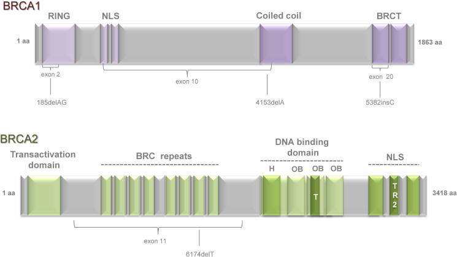
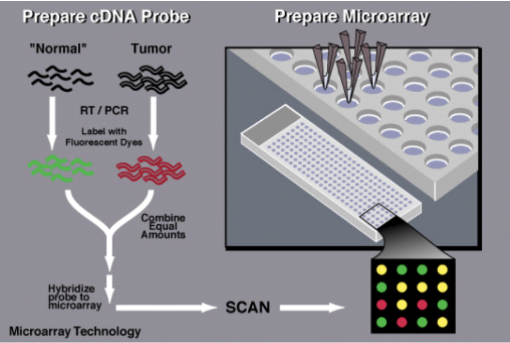
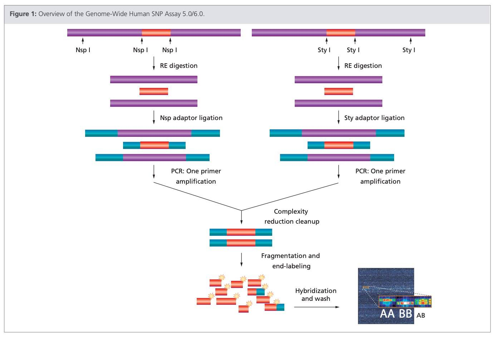
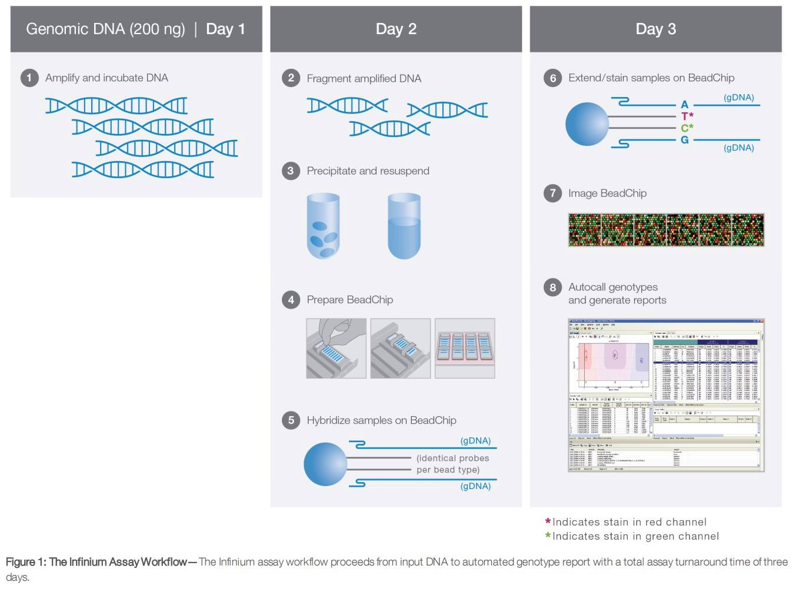
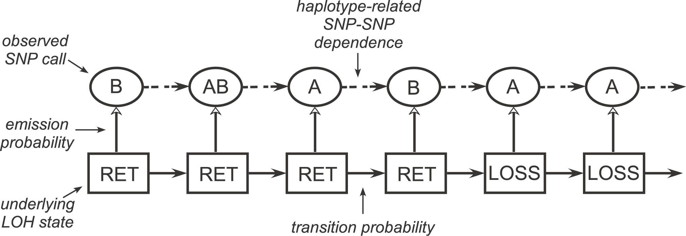

Urvashi Kumar

Shruti Vakharia

Nicholas Bavafa

--------------------------------------------------------------------------------

# Predictive Genomics

## Introduction

Predictive genomics is a personalized application of statistics and genomics that uses gene-based diagnostic tests to make models and estimates of the likelihood of a patient contracting certain hereditary diseases. Predictive Genomics is a fairly new field that's still in the pioneering stages. The idea of predictive genomics stems from the early 2000s, when the first rendition of the human genome was sequenced (1). In the beginning, predictive genomics began with comparative studies searching for SNPs which might indicate disease development in the future. This field relies on using statistics and data modeling along with principles of genetics to give patients an idea of how likely it is that they will get a disease along with how likely it is that they may pass it on to their children.

Probably the most well-known predictive genomics company is 23AndMe, a company associated with at-home testing kits that provide consumers with a report of their ethnic background. However, the company is also invested in personalized therapeutics as well, and have identified common genetic factors for diseases such as schizophrenia and Parkinson's disease. Another company primarily involved in using predictive genomics research is GenomicPrediction, which offers genomic testing for embryos used in in vitro fertilization to ensure better newborn health by selecting the healthiest embryos prior to implantation. The company was founded in 2017 and offers genomic sequence quantification kits as well as expanded pre-implantation genomic testing that covers more genomic diseases in embryos and focuses on polygenic diseases as well. Another company that is local, as well as a leader in the industry, is Illumina, offering whole-genome sequencing, next-generation sequencing as mentioned in class, and other high-throughput services that offer customers the ability to learn more about their genetic background.

This research is also somewhat controversial due to the possible applications to predict people's traits beyond diseases, such as intelligence and appearance, which raises ethical questions amongst some critics. 23AndMe also addresses some of the ethical questions of predictive genomics by prioritizing research subject privacy and emphasizing informed consent from all participants. Overall, this is a relatively new technique that relies on knowledge of human inheritance to make helpful predictions about a patient's health to empower them with knowledge of their own genetic background.

## Applications

Applications for predictive genomics are mostly involved with diseases that can be traced back to a single gene. Due to the complex nature of polygenic inheritance, the behavior of diseases caused by multiple genes is often harder to predict through traditional methods used in predictive genomics. An example of this is in using predictive genomics to determine the percentage that a person with the BRCA1 or BRCA2 gene will develop breast or ovarian cancer. Genetic counseling is widely available to assess whether testing is a useful step for the patient, which determines whether the patient has inherited a defective copy of the gene. Predictive genomics is applied by analyzing homologous recombination deficiency, loss of heterozygosity, and other tests (3). Currently, another application also relating to cancer is finding oncogenic mutations on certain chromosomes, in which predictive genomics is used to make statistical links between where mutations occur and how that influences the likelihood of cancer developing (4).

## Diseases

The bulk of the diseases that are currently used in predictive genomics are diseases that stem from a hereditary mutation. One of the biggest use cases for predictive genomics currently is testing for mutations in genes that could result in elevated cancer risk (1). The breast cancer susceptibility genes (BRCA) is a pair of genes that are crucial in tumor suppression. These genes encode for enzymes that repair mutated DNA via homologous recombination. Mutations in BRCA 1 and/or BRCA 2 can result in an increased risk of breast and ovarian cancers and are responsible for over 20% of breast and ovarian cancers. Because of a strong correlation between mutated BRCA genes and increased cancer risk, genetic testing for these mutations can be done in order to determine the best course of preventative measures.

 

_FIGURE 1: BRCA GENE diagrams_

Every year, BRCA gene testing has become more and more accessible. Nonetheless, BRCA testing is still limited to those who have some sort of tie to a potential increased risk of cancer. The general criteria for considering a BRCA gene test fall into two main categories, a personal history of cancer before advanced age, or extensive family history with cancer. A personal history of cancer includes history with any of the BRCA-related cancers during young/middle-aged years or history with multiple types of cancers. Extensive family history with cancer includes multiple family members being diagnosed with cancer or a family history of having mutated BRCA genes. The only thing required from the patient is a blood sample taken at their physician's office. Once taken, the sample can be sent in to a number of labs to be screened for BRCA 1/2 mutations. The biggest labs that currently offer BRCA gene testing are Myriad Genetics, Medical Diagnostics, and Quest Diagnostics.

However, there are some diseases that are much more environmentally dependent that can not be used in predictive genomics with strong statistical backing. An example of this is Type 2 diabetes. Even after genetic markers for type 2 diabetes were determined, no strong correlation between genetic variants and the chance of developing the disease could be concluded (6). This is because the chance of developing type 2 diabetes is much more dependent on an individual's environment rather than their genetic makeup.

## Algorithms/Technologies

### SNP Array

Single Nucleotide Polymorphisms are locations in the human genome where there can be a single base-pair difference between the members of the population (8). "If more than 1% of the population does not carry the same nucleotide at a specific position in the DNA sequence, then this variation can be classified as a SNP." (9).While three or four alleles are possible, most polymorphisms only have two alleles. SNPs are passed down from one generation to the next and SNP analysis helps us find about a person's susceptibility to diseases, drug response and is also used in ancestry analysis (8).

SNP Array is a type of a DNA Microarray used to find out if an individual carries the mutation responsible for a specific disease. It is widely used to detect cancer biomarkers. This is done by analyzing which genes are expressed in a tissue. SNP Arrays are often used to compare the pattern of gene expression in tumor versus normal tissue. For simplicity, the two possible alleles at the SNP position be A and B. Since each individual has 2 copies of the SNP, the possible genotypes are AA, AB, BB. (12)

 _FIGURE 2: SNP Microarray Workflow_

#### Workflow of SNP Arrays (7)

1. mRNA is isolated from both tissue samples. It is converted to cDNA (complementary DNA) using the process of reverse transcription.
2. The cDNA for both samples is amplified using Polymerase Chain Reaction (PCR).
3. The cDNA is labeled with a fluorescent dye, red dye for patient cDNA (tumor) and green for control/normal cDNA.
4. Equal amounts of both samples are combined and hybridized on the microarray.
5. The microarray is a glass or silicon slide containing several spots. Each spot contains a pair of single-stranded DNA sequences. The pair of sequences are oligonucleotides which are known to be associated with a particular gene. Both oligonucleotides are identical except for the SNP, where each of the 2 sequences represents a possible allele for the SNP (12). The mixture of fluorescently dyed cDNA sample is added to the microarray.
6. cDNA samples hybridize to the oligonucleotides on the microarray that they are complementary to and attach to their respective locations on the slide. If only one of the oligonucleotides on the spot is bound to a cDNA, we can conclude that the person is homozygous for that loci/gene. However, if cDNA was bound to both the oligonucleotides in a spot, it meant that an individual was heterozygous for the loci.
7. cDNAs that aren't complementary to none of the oligonucleotides are washed off the slide.
8. This microarray is then scanned using a scanner. The fluorescent dye glows when hit with the laser and we can visualize which cDNA binds to which gene by detecting the fluorescent signals.

    A red glow in a spot means that that particular gene has higher expression in the tumor cDNA. A green glow signifies the higher expression of that gene in normal cDNA. A yellow glow signifies the equal expression of the gene in both tumor and normal cDNA. If some spot, has no glow, it means that the gene isn't expressed in either of the cDNA samples.

This analysis helps researchers see which genes are differentially expressed in cancerous vs. normal tissue. This can help design better drug treatments, genetic therapies, and tests for early detection of cancer. People who have a history of genetic diseases are recommended to get precautionary testing done to find out if they carry the mutations relating to the diseases. Especially in breast cancer, when a parent is known to be affected by it, children are recommended to get tested to get preventive surgery/treatments. Currently, the two most popular SNP array platforms used in the industry are (12):

 _FIGURE 3: The difference in SNP Array techniques - Affymetrix vs. Illumina_

1. ##### Affymetrix Genome-Wide Human SNP Array 6.0 (12)

  In this technique, every SNP site interacts with several probes. Some of these probes might be associated with allele A while others with allele B. In addition, the probes must be perfectly complementary (Perfect-match) to the cDNA containing the SNP site, as it helps us identify the nucleotide present at the specific SNP site (genotype-calling). The probes are represented as PMa and PMb. The intensity of cDNA interaction with these probes is used to detect the genotype at the SNP site.

   _FIGURE 4: Affymetrix Genome-Wide Human SNP Array 6.0 Workflow (10)_

  Data Analysis for Human SNP Array 6.0 (12)

  The genotyping algorithm used for the Affymetrix Genome-Wide Human SNP Array 6.0 is called Birdseed. It helps normalize the raw intensity data for each SNP (pair values - one for each allele) and convert it to biologically meaningful material. The raw intensity counts are normalized to rectify any hardware/software bias and to ensure a uniform probe intensity distribution among different arrays. Birdseed converts the raw intensities into allele-specific signals by applying a median polish method (12). "Internally-run array data from 270 individuals determines expected locations of the clusters formed by plotting _A_ signals versus _B_ signals _a priori_. Birdseed fits the signals from the test samples to a two-dimensional Gaussian mixture model using an expectation-maximization (EM) procedure, with initialization provided by the a priori expected locations. " (12). A confidence score for every possible genotype at the SNP site is obtained, helping us detect the genotype at all SNP sites (12). For more information about Birdseed, please see: <https://www.genome.gov/sites/default/files/genome-old/pages/About/OD/OPG/GAIN-WorkshopII/GAIN-II-KuruvillaBirdseed.pdf>

2. ##### Illumina Infinium Assay

  The Illumina Infinium Assay uses a single-nucleotide extension approach to genotype Single Nucleotide Polymorphisms (5). They also use a "BeadChip" which is very similar to a spot on the microarray slide as described in the SNP Array workflow, but when cDNA binds to the bead, DNA polymerase comes and extends the nucleotide chain. This helps them with genotype-calling.

  The normalization in the Infinium assay is done internally. Before analyzing the output, raw allele intensities are transformed using a ratio, defined for every specific SNP. This data is then clustered (into 3 clusters for each genotype - AA, AB, BB), and a sample's proximity to the clusters helps determine its genotype/cluster membership (12). It is also preferred that the clusters are distinct and well-separated as that usually means the SNP-quality is higher (12).

   _FIGURE 5: Illumina Infinium Assay Workflow (11)_

  Data Analysis for Illumina Infinium Assay (13) GenomeStudio is a software provided by Illumina which helps you analyze and visualize the results of your Infinium Assay. The software has different modules for different kinds of analyses. The genotyping module is the most relevant to our topic. It helps with genotype calling, normalizing, clustering the SNP data (the 3 genotypes - AA, AB, BB represent 3 clusters) and helps with Loss of Heterozygosity (LOH) calculations. It also helps perform statistical analysis for copy number variation analysis, which is an integral part of predicting cancer risk by observing biomarkers. Another important module is the Gene Expression Module, which helps us analyze the differential expression and visualize gene expression levels in different genes across different genomes using a heatmap. For more information about GenomeStudio, please refer: <https://www.illumina.com/techniques/microarrays/array-data-analysis-experimental-design/genomestudio.html>

#### Detection of Loss of Heterozygosity (LOH) using SNP Arrays (12)

LOH is defined as "the sporadic loss of all or part of two parental chromosome homologs" (12). LOH is often described as a characteristic feature of tumor cells. LOH is the shift from Heterozygosity to Homozygosity in a SNP and SNP arrays are used to detect the genotype of a SNP making them a good method to detect LOH (12). Hidden Markov Models were used to interpret continuous homozygous sections in the genome and determine if they were related to the cancer phenotype. Considering the HMM structure, the two hidden possible states can be thought of as "loss" or "retention" and all SNPs can be the "units" of the markov chain in the HMM. Initially, pairs of normal and tumor genotypes from the same individual were required to do this kind of analysis (12). However, with the advances in technology, researchers have now been able to do HMM analysis with solely tumor genotypes available (16).

 _FIGURE 6: HMM of LOH genotype (16)_

#### Why is RNA-Sequencing Preferred over Microarrays? (15)

As presented in class, RNA-seq technology is often preferred to other sequencing methods such as microarrays for a few reasons. An advantage of RNA-seq is that it is more sensitive and can detect minor changes better than microarrays, such as single nucleotide variants. In addition to being more sensitive to minor changes, RNA-seq can also detect differentially expressed genes better than microarrays. This allows RNA-seq to perform analysis on a more dynamic range of samples, including smaller samples that would present a challenge for microarray analysis. However, Microarrays are still widely used to query a smaller range of SNPs as they are cheaper than New Generation Sequencing Approaches.

 _FIGURE 7: Difference between DNA Microarray and RNA Sequencing (14)_

--------------------------------------------------------------------------------

**Bibliography**

1. Marzuillo, C., De Vito, C., D'Andrea, E., Rosso, A., & Villari, P. (2013). Predictive genetic testing for complex diseases: a public health perspective. _QJM: An International Journal of Medicine_, _107_(2), 93-97. <https://www.ncbi.nlm.nih.gov/pmc/articles/PMC3905632/>

2. Warren, M. (2018). The approach to predictive medicine that is taking genomics research by storm. _Nature_, _562_(7726), 181-184. 
[www.nature.com/articles/d41586-018-06956-3](http://www.nature.com/articles/d41586-018-06956-3).

3. Wang, E., Zaman, N., Mcgee, S., Milanese, J. S., Masoudi-Nejad, A., & O'Connor-McCourt, M. (2015, February). Predictive genomics: a cancer hallmark network framework for predicting tumor clinical phenotypes using genome sequencing data. In _Seminars in cancer biology_ (Vol. 30, pp. 4-12). Academic Press. <https://www.sciencedirect.com/science/article/pii/S1044579X14000509?via%3Dihub>

4. Timms, K. M., Abkevich, V., Hughes, E., Neff, C., Reid, J., Morris, B., ... & Iliev, D. (2014). Association of BRCA1/2 defects with genomic scores predictive of DNA damage repair deficiency among breast cancer subtypes. _Breast Cancer Research_, _16_(6), 475. 
<https://www.ncbi.nlm.nih.gov/pubmed/25475740>.

5. Steemers, F. J., Chang, W., Lee, G., Barker, D. L., Shen, R., & Gunderson, K. L. (2006). Whole-genome genotyping with the single-base extension assay. _Nature methods_, _3_(1), 31. 
<https://www.ncbi.nlm.nih.gov/pubmed/16369550?dopt=AbstractPlus>

6. Gorodetska, I., Kozeretska, I., & Dubrovska, A. (2019). _BRCA_ Genes: The Role in Genome Stability, Cancer Stemness and Therapy Resistance. _Journal of Cancer_, _10_(9), 2109–2127\. doi:10.7150/jca.30410 <https://www.ncbi.nlm.nih.gov/pmc/articles/PMC6548160/>

7. _DNA Microarray Technology Fact Sheet_. (2015, August 27). Retrieved from [www.genome.gov/about-genomics/fact-sheets/DNA-Microarray-Technology?fbclid=IwAR0O2ybbVZqTqke4Ymz-ixcQ5DyAmE0Ae6HwlmUXuAxb4P2Ud-6cN763vlQ](http://www.genome.gov/about-genomics/fact-sheets/DNA-Microarray-Technology?fbclid=IwAR0O2ybbVZqTqke4Ymz-ixcQ5DyAmE0Ae6HwlmUXuAxb4P2Ud-6cN763vlQ). B

8. What are single nucleotide polymorphisms (SNPs)?. (2019, November 26). Retrieved from <https://ghr.nlm.nih.gov/primer/genomicresearch/snp>

9. SNP. (n.d.) Retrieved from <https://www.nature.com/scitable/definition/snp-295/>

10. Affymetrix Genome-Wide Human SNP Array 6.0 Data Sheet. (n.d.) Retrieved from <http://tools.thermofisher.com/content/sfs/brochures/genomewide_snp6_datasheet.pdf>

11. Illumina Infinium Array Workflow. 2017\. Retrieved from <https://www.illumina.com/content/dam/illumina-marketing/documents/products/workflows/workflow_infinium_ii.pdf>

12. LaFramboise, T. (2009). Single nucleotide polymorphism arrays: a decade of biological, computational and technological advances. _Nucleic acids research_, _37_(13), 4181-4193.
<https://www.ncbi.nlm.nih.gov/pmc/articles/PMC2715261/>

13. Convert array Data into Meaningful results. (GenomeStudio). 2019\. Retrieved from <https://www.illumina.com/techniques/microarrays/array-data-analysis-experimental-design/genomestudio.html>

14. RNA Seq vs Microarray. (n.d.). Retrieved from <https://www.otogenetics.com/rna-sequencing-vs-microarray/>

15. Advantages of RNA-Seq Technology. 2019\. Retrieved from <https://www.illumina.com/science/technology/next-generation-sequencing/microarray-rna-seq-comparison.html>

16. Beroukhim, R., Lin, M., Park, Y., Hao, K., Zhao, X., Garraway, L. A., ... & Descazeaud, A. (2006). Inferring loss-of-heterozygosity from unpaired tumors using high-density oligonucleotide SNP arrays. _PLoS computational biology_, _2_(5), e41. <https://journals.plos.org/ploscompbiol/article?id=10.1371/journal.pcbi.0020041>
