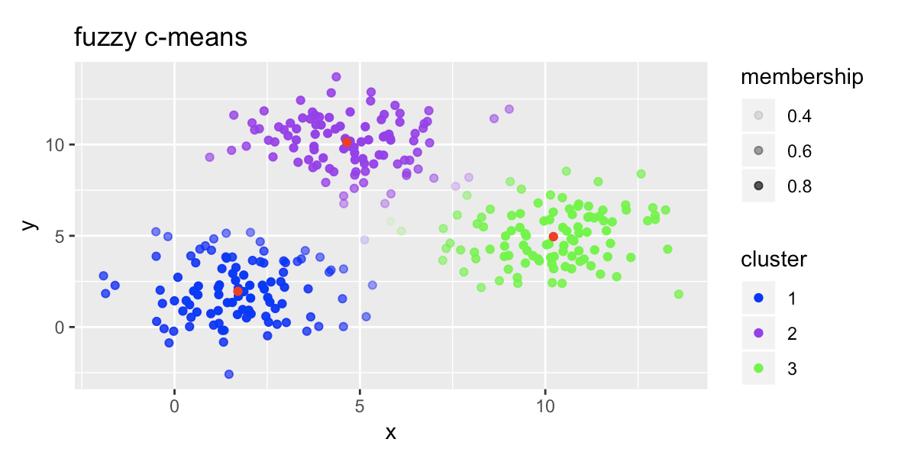
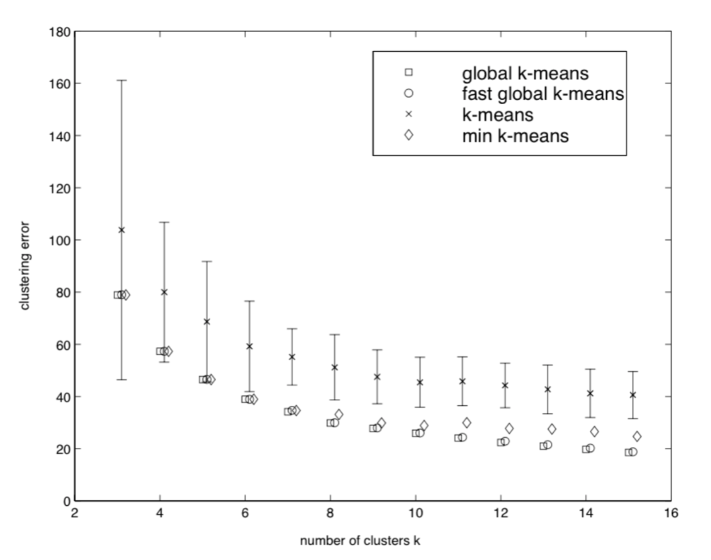
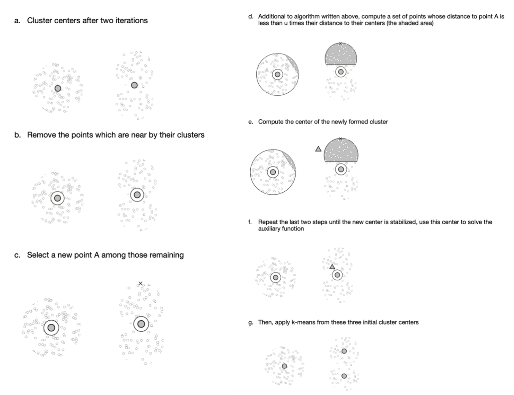
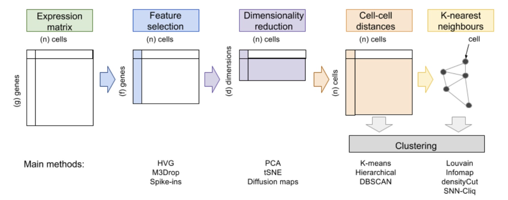
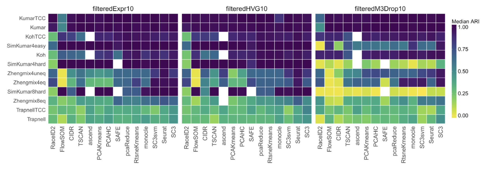
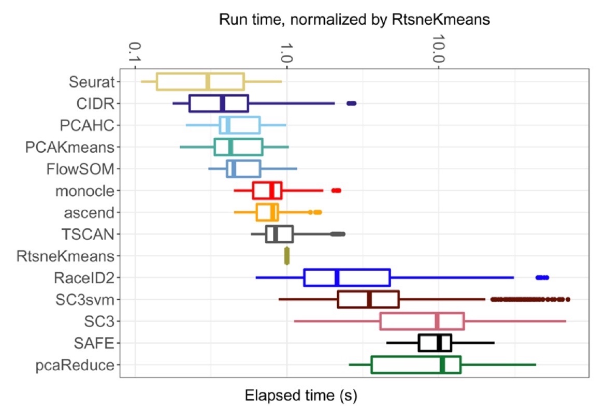

# Different Clustering Algorithms in Biological Data Analysis

## By Hanqing Zhao, Jianing Wang, Shihui Zhu

* [Overview](#overview)

* [k-Means Clustering](#k-means-clustering)

* [Global k-Means Clustering](#global-k-means-clustering)

* [Fuzzy c-Means Clustering](#fuzzy-c-means-clustering)

* [Mixture of Gaussian Clustering](#mixture-of-gaussian-clustering)

* [Discussion](#discussion)  

* [Application in RNA-seq Data](#application-in-rna-seq-data)

* [Reference](#reference)

## Overview

Clustering is a really useful machine learning technique for analyzing all kinds of data. It can help us to group certain data points that have similar properties in a large dataset, in order to grab information from it. In biological research, we often obtain lots of data from the experiments. In order to shuffle the useful information from the sea of data, it is crucial for us to correctly interpret the patterns behind it using clustering. We can use clustering method in gene expression data obtained from RNA sequencing, to discover potential groups of genes and samples, and predict the unknown functions of genes.
In this report, we are going to expand on what we have learned about k-means clustering in the class, introduce global k-means, fuzzy c-means clustering, and Mixture of Gaussian clustering methods. Additionaly, we will discuss how they are different and useful in genomic data analysis.

## *K*-Means Clustering

K-means clustering is a clustering algorithm that essentially partitions all data points into k clusters with locally optimal within-cluster sum of squared Euclidean distances. The standard algorithm starts with a given initial set of k cluster centers [11]:

Step 1: For each point, find its closest cluster center and assign it to the closest cluster.  
Step 2: Update the cluster centers to be the average of points contained within them.  
Step 3: Stop if the algorithm converges (that is, the cluster assignments no longer change). Otherwise, go to Step 1.

Here is a GIF demo:

## Global *K*-Means Clustering

As mentioned, k-means clustering results are sensitive to the initial choice of clusters therefore they are only reliable for analyzing small sets of data. To improve it, auxiliary incremental approaches are recently introduced to k-clustering algorithm, which are known as the global k-means clustering.  

One traditional way is to start from one cluster (centroid), and continuously adding new clustering center as the iteration proceeds. 

Step 1: Given the finite data set , , consisting of m n-dimensional elements, compute A’s center, set this as the initial center.  
Step 2: Let the rest (-1)-partition centroids be , compute , by comparing the minimum square distance between each point and the closest cluster center from  with the square distance of each pair of data. So the point with the minimum  value would be the new cluster center for the next iteration.  
Step 3: Select  as a new starting point, apply the k-means algorithm. Then use the result as the input, go back to step 2.  
Step 4: Stop iteration if  is smaller than a given tolerance value

## Fuzzy c-Means Clustering

The fuzzy c-means clustering (FCM), also referred to as soft k-means clustering, is a clustering algorithm that partitions the data set into c clusters while each data point may potentially belong to multiple clusters. Compared to the well-known k-means clustering, FCM introduces a new attribute for each data point: **membership**. The membership function evaluates the similarity between a data point to each cluster center, and it ranges between 0 and 1, where memberships close to zero indicates little similarity between the point and the center, while memberships close to one indicates a high degree of similarity between the sample and the cluster. The algorithm starts with a given initial set of *c* cluster centers:  

Step 0: Determine all parameters needed for the algorithm, and initialize  membership matrix randomly  

*  = the fuzzy c-partition of all data points after  iterations)
*  = the number of data points
*  = the number of cluster centers
*  = Euclidean distance between  data point and  cluster center
*  = the  cluster center
*  = weighting component, *aka* the fuzzifier; 
*  = membership of  data point to  cluster center
*  = the  data point  

Step 1: Compute the fuzzy memberships for each data point  

Step 2: Update the cluster centers according to the membership matrix

Step 3: If , that is, the change made by this iteration is less than some termination criteria, the algorithm stops. Otherwise, go to Step 1.

The result of clustering may look like this:

## Mixture of Gaussian Clustering

The Mixture of Gaussian clustering method is a way to cluster data points not only by the means, but also by variance. Therefore, it can make the cluster more correctly in some circumstances. Gaussian Mixture Models (GMMs) assume that there are a certain number of Gaussian distributions, and each of these distributions represents a cluster. Hence, a Gaussian Mixture Model tends to group the data points belonging to a single distribution together.

GMM is a probabilistic model that uses soft clustering method to distribute the points in different clusters. Soft clustering, also known as fuzzy clustering or soft k-means, is a form of clustering method in which one data point can belong to more than one cluster. The GMM uses the probabilistic density function in a 3D gaussian distribution is given by:

*  = the input vector. 
*  = 2-D mean vector
*  = 2  2 covariance matrix

Therefore, when we cluster the datasets in a 2 dimensional plot, we will define  clusters, so we will have a mixture of  Gaussian distributions, with each of them having a mean vector and a variance matrix.  

Since we do not know these mean and variance because we do not know which Gaussian generated which data point, these parameters are calculated by a process called Expectation-Maximization (EM), which involves two steps --- the E-step and the M-step. We also have a parameter called  which represent the density of the distribution.

During the E-step, we compute the responsibilities for each Gaussian for each datapoint. The responsibility () is calculated by dividing the Probability of  belongs to cluster  by the Sum of probability  belongs to . This value will be big if the point is assigned to the correct clusterm and low otherwise.

During the M-step, we modify the parameters of each Gaussian to maximize the likelihood for the responsibility weighted data. The density , mean  and the covariance matrix  are updated until convergence. They are updated following the manner below:

  

  

Here is a GIF demo for the algorithm:

## Discussion

### Limitations

Standard *k*-means clustering requires a careful selection of initial cluster centers. A different initialization may yield to a different number of iterations required for convergence, and a different clustering results. However, in some cases, the algorithm may not converge at all. In addition, the algorithm produces a clustering that attains local optimum, and more importantly, there may be different cluster assignments that have the same optimal scores [11]. Last but not least, the standard k-means clustering is vulnerable to the noise, thus its reliability is compromised provided the data is fuzzy.

### Comparions between *k*-means and FCM

Both k-means and FCM are partition-based clustering algorithm, and they work in a similar iterative fashion. The key difference between FCM and k-means is that using FCM, each data points may belong to multiple clusters based on the computed membership values. These fuzzy classification makes the clustering less vulnerable to noise if the input data is a bit fuzzy. For instance, when clustering of microarray data, k-means clustering may not work well because it does not provide information about the influence of a given gene for the overall shape of clusters. On the other hand, FCM is one fuzzy partitioning method and can attribute cluster memberships to genes [4].

However, as FCM is a bit more complex than k-means, it has a slower runtime compared to k-means clustering. As Velmurugan performed comparative analysis of k-means and FCM on telecommunication data [11], he pointed out that k-means runs significantly faster than FCM (Fig. X).

| |
|:--|
| Fig. Comparison of average time for k-Means and FCM. The table on the top shows the average executation time by k-Means and FCM. The plot at the bottom shows average runtime of k-Means and FCM.|

### Comparison between *k*-means and global *k*-means

Because global *k*-means clustering involves a series of computation of the auxiliary function , which produces an affinity matrix in every iteration, it requires longer runtime and greater computation power comparing with the standard *k*-means clustering. However, this gives a much better set of centroids for initial *k*-clusters because at each iteration the cluster centers can be refined according to the previous ones (Fig.).

| |
|:--|
| Fig.X A diagram comparing the differences in clustering error between difference k-means clustering methods. Notice that global k-means has the lowest error [8].|

One way to improve its runtime is to reduce the unnecessary computations by removing data points that are close to the centroid of the previous iteration when we are calculating , and use the triangle inequality while calculating distances to avoid repeats. The algorithm is illustrated below:

| |
|:--|
| Fig.X Diagram of the algorithm from the paper.|

### Comparison between GMM and *k*-means

Although *k*-means clustering method is widely used in biological data analysis, it is also simple to understand and implement, it has certain drawbacks and limitations that we need to be aware of. Firstly of all, *k*-means is hard clustering, which means one data point can only belong to one specific cluster, so it sometimes cannot handle dataset with noise as well as soft clustering method such as fuzzy *c*-means and GMM. Secondly, comparing k-means and GMM, k-means uses distance based model while GMM uses distribution-based model. *K*-means will attempt to group the data points in a circular form because the means is calculated by Euclidean distance. Therefore, *k*-means fails to identify the correct cluster when the data points are not in circular fashion, which is shown in the picture below.

Here is an example of how k-means clustering does not perform as well as the mixture of Gaussian clustering method, because the dataset not only need to consider mean, but also need to consider variance.

| |
|:--|
| Fig X. Comparison of average time for k-Means and FCM. The table on the top shows the average executation time by k-Means and FCM. The plot at the bottom shows average runtime of k-Means and FCM.|

### Real Case Analysis and Comparison of the Clustering methods

The Gaussian mixture model uses density based clustering method, which takes into account of variance in the dataset, so it can be used to analyze data points that do not form circular shaped clusters. The Gaussian mixture model have been shown to be a powerful tool for clustering in many applications including bioinformatics [7].

According to. Zhe Liu *et al.*’s paper about using using a new clustering method to analyze gene expression data, they are using the model based off of multivariate Gaussian mixture models. Since the EM algorithm in GMM is highly dependent on the initialization, Zhe Liu *et al*. proposed a new method by first initialized the cluster *k* using *k*-means, and then using the GMM to refine the cluster until it converges [9].

In the paper, Zhe Liu et al.  also compare the performances of their improved EM algorithm, the classic EM algorithm, which is the GMM we introduced before, EM algorithm based on multivariate distributions, and two standard clustering --- Fuzzy *c*-means and *k*-means clustering, which we also introduced in our report. Therefore, the table generated in the paper is a good visualization of comparing our introduced clustering methods [9].

They compared the clustering method by Precision (P), Recall (R), F-measure and ARI, where ARI means the adjusted rand index and F-measure is calculated by . The higher the value of ARI, the cluster generated by algorithm is more close to the real cluster. The higher the F-measure is, the better the clustering performance [9].

| |
|:--|
| Table 1. Comparison of the clustering results of various classification methods on the rat CNS data. |

| |
|:--|
| Table 2. Comparison of the clustering results of various classification methods on the human fibroblasts serum data|

According to Table 1 and 2, we can see that the performance of the improved EM from the paper is the best over all. If we only take a look at the three clustering methods we mentioned above, the *k*-means, fuzzy *c*-means and Gaussian mixture model using the traditional EM algorithm, we found that the EM algorithm performs the best, fuzzy *c*-means the second, and *k*-means is the last. However, *k*-means still have the advantage of faster calculating time, and easier to implement. Therefore, we need to choose the appropriate clustering method from case to case in order to have the best results.

## Application in RNA-seq Data

Fuzzy *c*-means and MOG are both relatively powerful clustering methods that are used for various data analysis that involves with microarray or other more complex datasets that cannot simply be done by *k*-means, as we shown in the discussion section. Here we specifically introduce the application of more modern clustering methods in single cell RNA-seq data analysis, and it has the comparison of *k*-means and many advanced clustering methods.

RNA-seq technology is widely applied in research as an attractive alternative to microarray-based methods to study global gene expression. However, due to the massiveness of data obtained, especially for single-cell RNA-seq analysis, scientists are still looking for more robust way to analyze the pattern in RNA-seq.

| |
|:--|
| Fig X. The diagram describing the general procedure of clustering of single-cell RNA-seq data. Each colored part indicates which proportion of the matrix is adjusted. For instance, the feature selection part removes rows from the original data set. And the dimensionality reduction calculates a new matrix composed of meta-features [1].|

In RNA-seq analysis, we can use built-in clustering methods in R script. To understand the performance between different clustering method, we can illustrate using real scRNA-seq data sets ,  GSE60749-GPL13112 (Kumar), SRP073808 (Koh) and GSE52529GPL16791 (Trapnell) and a few others [4]. There are fourteen different clustering methods investigated, but we are particularly interested in k-means related methods: 
PCAKmeans (PCA dimension reduction (dim=30) and *k*-means clustering with 25 random starts), pcaReduce (PCA dimension reduction (dim=30) and *k*-means clustering through an iterative process. Stepwise merging of clusters and reducing the number of dimensions by PC with lowest variance), which is like the global *k*-means clustering method that involve step-wise computation.  
And an ensemble method SAFE of *k*-means clustering and other clustering methods SC3, CIDR, Seurat and t-SNE.

| |
|:--|
| Fig X. The diagram shows different median ARI score for different clustering methods. Each row is a different data set, and each column is a clustering methods. We can see that the k-means clustering methods only have median-to-low accuracy. |

| |
|:--|
| Fig X. The diagram shows the runtime for each clustering methods. |

In Fig X, *k*-means methods have shorter runtime compared to others. But notice that pcaReduce has a very long runtime, it requires re-calculation of the affinity matrix in each iteration, which is similar to global k-means clustering in the above section. [4]

Filtering out far-from mean data before clustering: Note that actual RNA-seq data can be noisy, and because *k*-clustering is a partitioning algorithm, genes might be eventually assigned to a cluster even if they do not actually fit in. 

Choosing value for k: Too small k-value can result in oversimplification of the data. To solve this, we can choose to examine different k-values using correlation function. If the correlation is high ( close to 1) between two *k*’s, we might consider reducing the value of *k* [12]. 

## Reference

1. Andrews, Tallulah S., Hemberg, Martin. “Identifying cell populations with scRNASeq” vol. 59, *Molecular Aspect of Medicine*. Feb., 2018.

2. Adil M. Bagirov, Julien Ugon, Dean Webb. “Fast modified global k-means algorithm for incremental cluster construction.”

3. Bezdek, J., Ehrlich, R. & Full, W. FCM: The fuzzy c-means clustering algorithm. *Computers & Geosciences* 10, 191-203 (1984).

4. Dembele, D., and P. Kastner. "Fuzzy C-Means Method For Clustering Microarray Data". *Bioinformatics*, vol 19, no. 8, 2003, pp. 973-980. *Oxford University Press (OUP)*, doi:10.1093/bioinformatics/btg119.

5. Duo, Angelo., et., al. “ A systematic performance evaluation of clustering  methods for single-cell RNA-seq data.” NCBI., 11 Sep. 2018. 

6. Hartigan, J. A., and M. A. Wong. "Algorithm AS 136: A K-Means Clustering Algorithm". *Applied Statistics*
, vol 28, no. 1, 1979, p. 100. *JSTOR*, doi:10.2307/2346830.

7. Jiang, D., Tang, C. and Zhang, A. (2019)."Cluster Analysis For Gene Expression Data: A Survey - IEEE Journals & Magazine". *Ieeexplore.Ieee.Org*, 2019, https://ieeexplore.ieee.org/document/1339264.

8. Likas, Aristidis. et., al. “The global k-means clustering algorithm.” *Pattern Recognition*. 4 March 2002.

9. Liu, Zhe et al. "A New Clustering Method Of Gene Expression Data Based On Multivariate Gaussian Mixture Models". *Signal, Image And Video Processing*, vol 10, no. 2, 2015, pp. 359-368. *Springer Science And Business Media LLC*, doi:10.1007/s11760-015-0749-5.

10. Singh, Aishwarya. "What Are Gaussian Mixture Models? A Powerful Clustering Algorithm". *Analytics Vidhya*, 2019, https://www.analyticsvidhya.com/blog/2019/10/gaussian-mixture-models-clustering/.

11. Sheng Zhong. "Intro to Machine Learning". BENG 183.

12. T., Velmurugan. "Performance Based Analysis Between K-Means And Fuzzy C-Means Clustering Algorithms For Connection Oriented Telecommunication Data". *Applied Soft Computing*, vol 19, 2014, pp. 134-146. *Elsevier BV*, doi:10.1016/j.asoc.2014.02.011.

13. Warner, Jake. "Clustering Rnaseq Data Using K-means Clustering -2-Bitbio". *2-Bitbio.Com*, 2019, https://2-bitbio.com/2017/10/clustering-rnaseq-data-using-k-means.html.

14. Warner, Jake. "Clustering Rnaseq Data Using Fuzzy C-Means Clustering - 2-Bitbio". *2-Bitbio*, 2019, https://2-bitbio.com/post/clustering-rnaseq-data-using-fuzzy-c-means-clustering/.
